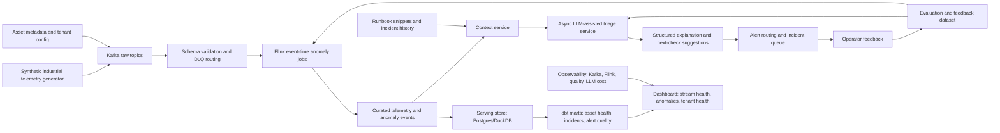

# Project Design: Real-time Industrial APM Data Pipeline with Flink and LLM-assisted Alert Triage

Generated: 2026-05-19

This Step 6 design turns the Top 1 project from `project_priority_scoring.md` into a production-grade, interview-ready portfolio plan. The deliberately safer title is **Real-time Industrial APM Data Pipeline with Flink and LLM-assisted Alert Triage**. The project should be presented as portfolio/current-project evidence unless additional real production evidence is provided.

## Inputs

| Input | How it is used |
|---|---|
| `sc_workexperience.md` | Fact boundary: verified experience includes industrial SaaS, multi-tenant data platform, Kafka sensor/industrial pipelines, S3, Snowflake, dbt, Dagster, data quality, lineage, alerting, tenant isolation, governance, and cost optimization. |
| `market_research_2026_ai_data_roles.md` | Market rationale: 2026 demand is strongest for Senior Data Engineer / Data Platform Engineer roles with AI-ready platform, real-time data, observability, governance, and evaluation-data capabilities. |
| `capability_gap_analysis.md` | Gap control: Flink is only skills-level evidence; LLM/RAG/vector/agent work is not verified work experience and must remain project evidence. |
| `project_direction_longlist.md` | Project source: Real-time Industrial APM Data Pipeline is a high-fit direction connected to industrial SaaS, Kafka sensor data, AI workloads, and observability. |
| `project_priority_scoring.md` | Priority source: Top 1 recommendation with required design focus on Kafka/APM event schema, Flink event-time processing, anomaly detection, LLM-assisted explanation, alert triage, tenant-aware routing, quality checks, dashboard, and resume packaging. |
| Sub-agent architecture review | Adds production architecture, data flow, module, reliability, cost, observability, security, and MVP scope recommendations. |
| Sub-agent career packaging review | Adds target-role mapping, resume wording, GitHub display, interview talking points, metrics boundaries, and risk wording. |
| Sub-agent skeptical review | Adds P0/P1 risk corrections: fact boundary, scope reduction, Flink semantics, LLM guardrails, SLOs, tests, CI/CD, cost controls, and out-of-scope constraints. |

## Findings

### 1. Project Name

| Field | Decision |
|---|---|
| Original Top 1 name | Real-time Industrial APM Data Pipeline with Flink + LLM Agent |
| Recommended public name | Real-time Industrial APM Data Pipeline with Flink and LLM-assisted Alert Triage |
| GitHub repository name | `industrial-apm-flink-agent-triage` |
| Step 6 artifact slug | `realtime_industrial_apm_flink_agent` |

The wording intentionally uses **LLM-assisted alert triage**, not autonomous diagnosis. The LLM component explains and summarizes evidence from the data platform; it does not decide real root cause, execute remediation, or control equipment.

### 2. Target Roles

| Role | Fit | Why this project helps |
|---|---:|---|
| Senior Data Engineer | High | Shows streaming, data quality, observability, warehouse marts, incident workflow, and production trade-offs. |
| Data Platform Engineer | High | Shows multi-tenant schemas, governed access, platform reliability, cost controls, and data contracts. |
| AI Data Engineer | High | Adds AI-assisted operations and evaluation data without pretending to own model training or RAG production systems. |
| Industrial AI Data Engineer | High | Directly connects industrial SaaS, sensor/APM data, anomaly-ready pipelines, and operator-support workflows. |
| ML Data Engineer, platform/evaluation focus | Medium-high | Creates anomaly-ready data marts, feedback labels, and quality/evaluation loops. |
| Streaming Data Engineer / Flink Engineer | Medium-high | Provides concrete Flink event-time portfolio evidence; must not be written as verified production Flink ownership. |
| LLM/RAG Data Engineer | Medium | Useful adjacent evidence for agent context and evaluation, but it does not cover full RAG/vector ownership. |
| AI Infrastructure / ML Platform Engineer | Low-medium | Does not cover GPU, model serving, feature store, Kubernetes, Terraform, or full MLOps ownership. |

### 3. Business Background

Industrial SaaS platforms ingest continuous telemetry from equipment, sensors, application performance monitors, device heartbeats, maintenance logs, and alert systems. A data team needs to detect abnormal conditions quickly, route alerts to the right operator, and provide enough context for human investigation.

This project designs a multi-tenant industrial APM data pipeline that:

1. Ingests synthetic industrial sensor and APM events into Kafka.
2. Processes events in Flink using event time, watermarks, keyed state, and windowed anomaly rules.
3. Writes curated telemetry, anomaly incidents, data quality outputs, and alert marts to serving storage.
4. Uses an LLM-assisted triage service to summarize anomaly evidence, suggest possible causes, and recommend next checks.
5. Tracks operator feedback and incident outcomes as evaluation data for improving rules, prompts, and alert quality.

The business value is not "AI magic." The value is a reliable, observable, tenant-aware data platform that can turn high-volume industrial telemetry into explainable incident workflows.

### 4. Fact Boundary And Resume Packaging Guardrails

| Category | Safe to claim | Must not claim without more evidence |
|---|---|---|
| Verified work experience | Multi-tenant industrial SaaS data platform, Kafka high-frequency industrial/sensor pipelines, S3/Snowflake architecture, dbt layered modeling, Dagster orchestration, tenant isolation, governance mechanisms, data quality, lineage, alerting, 60% compute-cost reduction, Poizon search/evaluation/feedback data. | Production-grade Flink project owner, production LLM agent owner, production RAG/vector/embedding platform, autonomous root-cause diagnosis, automatic remediation, model serving, feature store, Kubernetes/Terraform ownership, formal GDPR/APRA/OAIC compliance delivery. |
| Portfolio/current project | Kafka + Flink industrial APM pipeline, event-time anomaly rules, synthetic APM data contracts, LLM-assisted alert explanation, incident feedback dataset, simulated tenant isolation, dashboards, replay tests. | Real factory deployment, production SLA, real downtime reduction, real MTTR reduction, real industrial fault-prediction accuracy, production multi-tenant security guarantees, automatic agent repair. |
| Resume placement | Put Flink and LLM-assisted triage under `Projects`, `Selected Projects`, or clearly marked current portfolio project unless the user later verifies production delivery. | Do not merge Flink/LLM agent claims into Tamira work bullets as if already shipped in production. |

Recommended project positioning:

> Current portfolio project: building a real-time industrial APM data pipeline with Kafka, Flink event-time processing, rule-based anomaly detection, data quality checks, and LLM-assisted incident triage for operator support.

### 5. Core Stack

| Layer | Production-oriented choice | Portfolio MVP choice | Notes |
|---|---|---|---|
| Event ingestion | Kafka + Schema Registry | Redpanda or Kafka in Docker Compose | Use shared topics partitioned by `tenant_id` and `asset_id`. |
| Stream processing | Apache Flink | PyFlink or Flink SQL/Java job | Emphasize event time, watermarks, keyed state, checkpointing, late data, and replay. |
| Raw/curated storage | S3 or cloud object storage | MinIO or local object storage | Optional Iceberg/Delta should be Phase 2, not MVP blocker. |
| Serving store | Snowflake, ClickHouse, TimescaleDB, or Postgres | Postgres/DuckDB | Use idempotent upserts and dedupe keys rather than claiming end-to-end exactly-once. |
| Transformation | dbt | dbt + DuckDB/Postgres | Build anomaly, alert, tenant health, and quality marts. |
| Orchestration | Dagster | Dagster | Best bridge to verified experience and project observability. |
| Data quality | dbt tests, Great Expectations, Soda, custom checks | dbt tests + Python checks | Cover freshness, completeness, range, duplicate, schema drift, and heartbeat. |
| LLM triage | Internal LLM gateway with guardrails | OpenAI/Anthropic/local model abstraction | Async only; not in the critical detection path. |
| Dashboard | Grafana/Superset/Streamlit | Grafana or Streamlit | Show stream health, anomaly trends, incident queue, and LLM cost/latency. |
| Governance | IAM, RBAC/RLS, audit logs, masking | Simulated RBAC/RLS + audit tables | Mark as simulation unless real compliance evidence exists. |
| CI/CD | GitHub Actions, container build, test suites | GitHub Actions | Include schema, rule, SQL/dbt, replay, and prompt guardrail tests. |

### 6. System Scope

#### MVP Scope, 4-8 Weeks

| Area | Included in MVP |
|---|---|
| Synthetic data | Industrial SaaS-inspired telemetry generator with tenants, assets, sensors, APM events, heartbeat events, incident labels, runbook snippets, and tenant configs. |
| Kafka layer | Topics for raw telemetry, metadata/config, anomaly events, alert events, LLM explanations, feedback, and DLQ. |
| Flink layer | Event-time windowing, watermarks, keyed state, late-event side outputs, duplicate handling, statistical/rule anomaly detection, and checkpoint/replay demo. |
| Quality layer | Schema checks, range checks, missing heartbeat checks, completeness, freshness, duplicate checks, data quality flags on anomaly outputs. |
| Serving layer | Postgres/DuckDB tables and dbt marts for asset health, anomaly incidents, alert quality, tenant health, and stream reliability. |
| LLM triage | Async service that consumes curated anomaly context and outputs structured evidence-grounded summaries, hypotheses, recommended checks, and runbook references. |
| Feedback loop | Operator feedback labels for true/false positive, severity correction, useful/not useful explanation, and incident resolution note. |
| Observability | Kafka lag, Flink checkpoint/backpressure/watermark lag, late-event rate, anomaly volume, alert dedup rate, LLM latency/cost, JSON parse failures, data quality failure rate. |
| Portfolio display | README, architecture diagram, run scripts, sample data dictionary, dashboards, tests, demo scenario, and limitations section. |

#### Phase 2 Enhancements

| Enhancement | Why it is Phase 2 |
|---|---|
| Iceberg/Delta lakehouse tables | Strong market signal, but not needed to prove Top 1 streaming/triage story. |
| Full RAG/vector retrieval over runbooks | Valuable but risks turning the project into a different RAG platform. MVP can use simple metadata/runbook retrieval. |
| Advanced predictive-maintenance model | Risks shifting the story to ML modeling instead of data platform engineering. |
| Kubernetes/Terraform deployment | Useful for infrastructure roles, but not verified background and can distract from data engineering depth. |
| Multi-region or high-availability deployment | Production realism is good, but too broad for the first portfolio implementation. |
| Formal compliance framework | Can simulate controls, but must not claim regulated delivery. |

#### Out Of Scope

1. Autonomous equipment control or automated remediation.
2. Definitive root-cause diagnosis by LLM.
3. Real customer or factory data.
4. Production SLA or real downtime/MTTR reduction claims.
5. Full RAG/vector database platform.
6. Model training, model serving, feature store, GPU infra, or complete MLOps platform.
7. Formal GDPR/APRA/OAIC/UK FS compliance claims.

### 7. Architecture

### 8. Data Contracts

#### `sensor_event`

| Field | Type | Notes |
|---|---|---|
| `event_id` | string | Stable id for dedupe and replay. |
| `tenant_id` | string | Required; used for partitioning and access filtering. |
| `asset_id` | string | Equipment or logical service id. |
| `metric_name` | string | Example: `temperature`, `vibration`, `pressure`, `latency_ms`, `error_rate`. |
| `event_time` | timestamp | Source event time used by Flink watermarks. |
| `ingest_time` | timestamp | Pipeline ingestion time for freshness and lag metrics. |
| `value` | numeric | Metric value. |
| `unit` | string | Required for interpretable thresholds. |
| `source_system` | string | Gateway, APM collector, or synthetic source name. |
| `quality_flags` | array/string | Populated by validation and downstream checks. |

#### `asset_metadata`

| Field | Type | Notes |
|---|---|---|
| `tenant_id` | string | Tenant boundary. |
| `asset_id` | string | Join key. |
| `asset_type` | string | Pump, motor, conveyor, service, etc. |
| `site_id` | string | Simulated location or plant. |
| `criticality` | string | Used for severity routing. |
| `expected_metrics` | array/string | Used for completeness and missing-heartbeat checks. |
| `threshold_profile_id` | string | Points to tenant-specific thresholds. |

#### `anomaly_event`

| Field | Type | Notes |
|---|---|---|
| `anomaly_id` | string | Stable incident id. |
| `tenant_id` | string | Required for isolation. |
| `asset_id` | string | Affected asset. |
| `metric_name` | string | Trigger metric. |
| `window_start` | timestamp | Detection window. |
| `window_end` | timestamp | Detection window. |
| `rule_id` | string | Threshold, z-score, EWMA, missing heartbeat, CEP pattern, etc. |
| `severity` | string | Low/medium/high/critical. |
| `observed_value` | numeric/string | Evidence value or summary. |
| `baseline_value` | numeric/string | Baseline or expected range. |
| `quality_flags` | array/string | Late data, missing data, schema issue, etc. |
| `detection_confidence` | numeric | Rule/statistical confidence, not LLM certainty. |

#### `agent_explanation`

| Field | Type | Notes |
|---|---|---|
| `explanation_id` | string | Stable id. |
| `anomaly_id` | string | Parent anomaly. |
| `summary` | string | Operator-facing alert summary. |
| `evidence` | array | Must cite metric window, threshold, quality flags, asset metadata, or runbook source. |
| `possible_causes` | array | Hypotheses only. |
| `recommended_checks` | array | Human next steps. |
| `runbook_refs` | array | Source references. |
| `confidence_label` | string | Low/medium/high; must degrade when data quality is poor. |
| `model_name` | string | For audit and cost tracking. |
| `prompt_version` | string | For evaluation and rollback. |
| `token_cost` | numeric | Cost monitoring. |
| `latency_ms` | numeric | SLO monitoring. |

### 9. Data Flow And Service Flow

1. Telemetry generator emits synthetic sensor, heartbeat, APM, and alert events to Kafka.
2. Schema validation checks required fields, type constraints, tenant presence, event-time validity, and source-system identity.
3. Invalid or suspicious records are routed to DLQ and quality marts; valid records continue to Flink.
4. Flink assigns timestamps and watermarks, handles out-of-order records, applies keyed windows by `tenant_id`, `asset_id`, and `metric_name`, and computes rolling baselines.
5. Flink emits curated metrics, quality flags, and anomaly events. Late events go through side outputs and are included in late-event metrics.
6. Sinks write curated outputs with idempotent upserts or deterministic dedupe keys.
7. dbt builds marts for asset health, anomaly incidents, alert quality, stream health, and tenant-level SLA summaries.
8. The async triage service consumes high-severity or deduplicated anomaly events, fetches context from serving tables and runbook snippets, and calls the LLM.
9. The LLM returns structured JSON with evidence, possible causes, and recommended checks. Output validation rejects unsupported or malformed responses.
10. Alert routing deduplicates related events, applies severity rules, and surfaces incidents in the dashboard.
11. Operator feedback is stored as evaluation data for anomaly rules, alert routing, and LLM explanation quality.

### 10. Core Modules

| Module | Responsibility | Production-grade design notes |
|---|---|---|
| Synthetic telemetry generator | Produce repeatable industrial APM scenarios, including normal, delayed, missing, flatline, spike, drift, and correlated incident patterns. | Mark all data as synthetic. Include seeded scenarios for repeatable tests. |
| Event contracts | Define topic schemas, versioning rules, required fields, and compatibility checks. | Fail fast on breaking schema changes. Add data dictionary in README. |
| Kafka ingestion | Buffer raw events and metadata/config changes. | Partition by tenant and asset; use retention, DLQ, and schema validation. |
| Flink anomaly jobs | Compute windows, baselines, quality flags, and anomaly events. | Demonstrate event time, watermarking, late events, checkpointing, state TTL, and replay. |
| Quality validation | Validate freshness, completeness, range, duplicates, schema drift, heartbeat, and tenant boundaries. | Quality flags must travel with anomaly outputs and influence LLM confidence. |
| Serving and marts | Store curated data and build queryable data products. | Use idempotent writes; build dbt tests and marts for dashboard use cases. |
| Context service | Gather metric windows, baselines, asset metadata, historical incidents, quality flags, and runbook snippets. | Prevent cross-tenant context leakage. Return compact structured context. |
| LLM-assisted triage | Generate evidence-grounded summaries, hypotheses, and next-check suggestions. | Async only; structured output validation; fallback when model fails; no automatic remediation. |
| Alert routing | Deduplicate, suppress alert storms, apply severity rules, and route incidents. | Track alert volume, dedup rate, and operator feedback. |
| Feedback/evaluation store | Collect labels for true/false positive, severity correction, explanation usefulness, and resolution notes. | This becomes the bridge to Step 7 resume bullets and Step 8 interview prep. |
| Observability dashboard | Display pipeline health, data quality, anomalies, alerts, agent metrics, and tenant health. | Separate pipeline incidents from business anomalies. |

### 11. Production Concerns

| Concern | Design decision |
|---|---|
| Reliability | Use Flink checkpoints/savepoints, replayable Kafka topics, deterministic anomaly ids, idempotent sinks, DLQ, and backfill/replay scripts. |
| Event-time correctness | Use watermarks, allowed lateness, late-event side outputs, and metrics for watermark lag and late-event rate. |
| Exactly-once boundary | Claim Flink checkpointing and idempotent sink behavior only. Do not claim strict end-to-end exactly-once unless the sink and transactional guarantees are implemented and tested. |
| Alert fatigue | Deduplicate incidents, add cooldowns, correlate related anomalies, route by severity, and track true/false positive feedback. |
| LLM hallucination | Force evidence-grounded structured output, cite sources, reject unsupported claims, degrade confidence on poor data quality, and keep humans in the loop. |
| LLM latency and cost | Keep LLM off the critical path; triage only deduplicated/high-severity events; compact context; cache runbook snippets; track token cost and latency. |
| Security and governance | Enforce tenant-aware filters, simulated RBAC/RLS, audit logs, secret management, redaction of operator notes, and prompt-injection checks for runbook text. |
| Data quality | Track freshness, completeness, duplicate rate, range violations, schema drift, missing heartbeat, quality failure rate, and access leakage tests. |
| Scalability | Avoid hot partitions; tune Flink parallelism; set state TTL; compact metadata topics; define tenant quotas and retention tiers. |
| Operability | Provide runbooks for Kafka lag, Flink checkpoint failure, late-event spike, DLQ growth, LLM API failure, alert storm, and dashboard outage. |
| CI/CD | Run schema contract tests, anomaly rule tests, dbt tests, replay tests, out-of-order tests, prompt guardrail tests, and lint/build checks. |

### 12. Technical Difficulties

| Difficulty | Why it matters | How to handle it |
|---|---|---|
| Out-of-order industrial telemetry | Real sensor streams arrive late, duplicated, or in bursts. | Use event time, watermarks, allowed lateness, side outputs, and replay tests. |
| Stateful anomaly detection | Rolling baselines and keyed windows require state management. | Use keyed state by tenant/asset/metric, state TTL, and checkpoint monitoring. |
| Alert storms | A single incident can trigger many metrics and alerts. | Use deduplication, correlation keys, cooldown windows, and severity routing. |
| False positives | Noisy rules reduce trust quickly. | Track true/false positive labels, tune thresholds, and show precision/recall only on labeled synthetic incidents. |
| LLM unsupported reasoning | LLMs may invent causes beyond evidence. | Require evidence arrays, source references, output validation, and confidence downgrades. |
| Tenant leakage | Cross-tenant context would be a severe platform failure. | Test tenant filters, audit context retrieval, and add access leakage checks. |
| Scope creep | RAG, lakehouse, MLOps, and K8s can swallow the project. | Keep Top 1 focused on streaming APM and alert triage; move RAG/vector/lakehouse to Phase 2 or Top 2/3 projects. |

### 13. Trade-offs

| Decision | Recommendation | Rationale |
|---|---|---|
| Flink vs Spark Structured Streaming | Use Flink for this project. | Step 5 explicitly needs Flink + real-time signal, and Flink event-time/state discussion improves interview depth. |
| Rule/statistical anomaly vs ML model | Start with rules and lightweight statistics. | Keeps the project data-engineering-led and avoids unsupported ML modeling claims. |
| Sync LLM call vs async triage | Use async triage. | Keeps detection path reliable and cost-controlled. |
| Shared topics vs per-tenant topics | Use shared topics with tenant/asset partitioning for MVP. | Easier local implementation; discuss per-tenant topics as enterprise trade-off for large tenants. |
| Full RAG vs context retrieval | Use simple structured context retrieval in MVP. | Avoids turning Top 1 into a RAG platform; still shows agent context construction. |
| Snowflake vs local serving | Use Postgres/DuckDB for MVP; describe Snowflake production mapping. | Matches verified Snowflake background while keeping GitHub reproducible. |
| Exactly-once vs idempotent delivery | Use checkpointing plus idempotent sinks/dedupe. | More honest and easier to defend in interviews. |

### 14. Measurable Metrics

These are project metrics to measure after implementation. They should not be written as achieved resume metrics until measured.

| Metric | Purpose | Safe wording |
|---|---|---|
| Synthetic events/sec throughput | Demonstrate pipeline capacity. | Report only with local machine, parallelism, and dataset size. |
| p95 ingest-to-alert latency | Demonstrate real-time behavior. | Use demo environment wording. |
| Kafka consumer lag | Monitor ingestion health. | Good dashboard metric. |
| Watermark lag | Demonstrate event-time depth. | Strong Flink interview signal. |
| Late-event rate | Show disorder handling. | Pair with side-output behavior. |
| Checkpoint duration/failure rate | Show Flink operability. | Include failure-injection or restart demo if possible. |
| Data quality violation rate | Show quality controls. | Tie to freshness, completeness, range, duplicate, schema. |
| Alert dedup rate | Show alert-fatigue control. | Do not translate into real operational savings. |
| Anomaly precision/recall/F1 | Evaluate rules on labeled synthetic incidents. | Must say synthetic labels/public dataset only. |
| LLM JSON parse failure rate | Track agent reliability. | Shows practical AI engineering. |
| LLM p95 latency and token cost | Track cost and service behavior. | Good AI-ready platform metric. |
| Explanation usefulness rate | Track operator feedback. | Based on simulated or project feedback labels. |

Target SLOs for the portfolio implementation:

| SLO | Initial target |
|---|---:|
| Schema-valid event acceptance | >= 99% on generated valid events |
| p95 local ingest-to-alert latency | < 10 seconds in demo environment |
| LLM triage p95 latency | < 30 seconds for deduplicated incidents |
| Dashboard freshness | < 60 seconds for incident and stream-health views |
| Tenant leakage tests | 0 failing tests |
| Prompt/output validation | 100% malformed LLM outputs rejected or quarantined |

### 15. Why Employers Care

| Employer concern | How this project answers it |
|---|---|
| "Can this candidate build more than batch ETL?" | Shows streaming ingestion, Flink event-time processing, state, watermarks, replay, and operational dashboards. |
| "Can this candidate support AI workloads responsibly?" | Shows governed context construction, quality flags, feedback data, LLM cost/latency tracking, and evidence-grounded outputs. |
| "Can this candidate handle production reliability?" | Shows checkpoints, DLQ, schema contracts, data quality, observability, alert routing, runbooks, and tests. |
| "Can this candidate bridge industrial data and AI?" | Connects industrial SaaS, sensor/APM data, anomaly-ready marts, and LLM-assisted operator workflows. |
| "Can this candidate discuss trade-offs?" | Gives concrete trade-offs around Flink, exactly-once boundaries, async LLM calls, tenant partitioning, and scope control. |

### 16. Resume Packaging Direction

#### Verified Work Experience Material

Use these for work-experience bullets only if they are already supported by `sc_workexperience.md`:

- Built multi-tenant data platform foundations for industrial SaaS and AI/ML workloads using S3, Snowflake, dbt, Dagster, Kafka, governed access, and tenant isolation.
- Developed Kafka streaming pipelines for high-frequency industrial/sensor data, supporting tenant-aware ingestion and analytics workflows.
- Implemented Dagster-based orchestration and observability patterns for reliable hybrid data workflows, contributing to 60% compute cost reduction.
- Built lineage-backed data quality and alerting framework improving coverage from 18% to 100%.
- Delivered batch and real-time data pipelines supporting image-search model workflows, experimentation data, search evaluation, and user feedback loops.

#### Portfolio Bullet Material, After Project Completion

- Built a portfolio-grade real-time industrial APM pipeline using Kafka and Flink event-time processing to detect late, missing, and anomalous sensor/APM events.
- Designed tenant-aware APM event schemas, asset metadata, and alert marts to support anomaly triage, dashboarding, and incident review workflows.
- Integrated rule-based anomaly detection with LLM-assisted alert explanation to generate operator-facing summaries, root-cause hypotheses, and recommended next checks.
- Added data quality checks, freshness metrics, stream-health monitoring, and incident dashboards for anomaly trends, alert volume, and pipeline reliability.
- Implemented synthetic replay tests, out-of-order event tests, schema contract tests, and prompt guardrail tests to validate streaming and LLM-triage behavior.

#### Wording To Avoid

| Avoid | Safer wording |
|---|---|
| Autonomous root-cause diagnosis | LLM-assisted anomaly triage and operator support |
| Root cause identified | Root-cause hypotheses with supporting evidence |
| Production industrial deployment | Synthetic industrial APM demo or industrial SaaS-inspired portfolio project |
| Predictive maintenance model achieved X% accuracy | Rule-based/statistical anomaly detection evaluated on labeled synthetic incidents |
| Production Flink owner | Portfolio Flink implementation with event-time processing |
| GDPR/APRA/OAIC compliant platform | Simulated tenant isolation, RBAC/RLS, audit logs, and access tests |

### 17. Interview Talking Points

| Topic | What to emphasize |
|---|---|
| System design | `sensor/APM events -> Kafka -> Flink event-time jobs -> anomaly and quality outputs -> serving marts -> dashboard -> LLM-assisted triage`. |
| Kafka | Topic design, partitioning by tenant/asset, schema evolution, DLQ, retention, consumer lag, and replay. |
| Flink | Event time, watermarking, late events, keyed state, sliding windows, state TTL, checkpoint/savepoint, backpressure, and idempotent sinks. |
| Anomaly detection | Missing heartbeat, flatline, rolling z-score, EWMA, rate-of-change, threshold profiles, and cross-metric consistency. |
| Data quality | Freshness, completeness, range checks, duplicates, schema drift, tenant leakage, and quality flags that influence triage confidence. |
| LLM triage | Context construction, evidence-grounded summaries, output schema, hallucination controls, prompt/version tracking, token cost, and fallback behavior. |
| Observability | Kafka lag, watermark lag, checkpoint duration, state size, late-event rate, anomaly rate, alert dedup rate, LLM latency/cost. |
| Governance | Tenant-aware topics/tables, simulated RBAC/RLS, audit logs, redacted operator notes, and access leakage tests. |
| Incident response | Severity routing, alert dedup, runbook references, operator feedback, post-incident review, and feedback labels. |
| Fact boundary | Explain that Tamira experience supports industrial SaaS/Kafka/platform foundation; Flink + LLM triage is current portfolio/current-project evidence. |

### 18. GitHub / Portfolio Display Plan

| Artifact | Content |
|---|---|
| README | Problem, architecture, what is synthetic, what is measured, how to run, demo scenario, limitations, and resume-safe wording. |
| Architecture diagram | Kafka topics, Flink jobs, state/windowing, quality checks, serving marts, dashboard, LLM triage service, governance layer. |
| Data dictionary | Event schemas for telemetry, asset metadata, anomaly events, agent explanations, and feedback labels. |
| Sample data | Synthetic telemetry, APM events, asset metadata, tenant config, incident labels, maintenance/runbook snippets. |
| Dashboards | Stream health, data quality, anomaly trends, incident queue, LLM explanations, tenant-level health, LLM spend. |
| Tests | Schema contract tests, anomaly rule tests, dbt/SQL tests, replay tests, out-of-order tests, tenant isolation tests, prompt/output guardrail tests. |
| Demo | 3-5 minute workflow: inject anomaly -> Kafka replay -> Flink anomaly -> dashboard alert -> LLM-assisted explanation -> operator feedback. |
| Design note | Architecture decisions, trade-offs, limitations, and production mapping from local MVP to cloud/Snowflake/S3/Dagster. |

### 19. Implementation Roadmap

| Week | Deliverable | Details |
|---:|---|---|
| 1 | Synthetic data and event contracts | Define telemetry, APM, asset metadata, tenant config, incident labels, and runbook snippets. Create generator and schema validation. |
| 2 | Kafka and Flink MVP | Stand up Kafka/Redpanda, topics, Flink job, event-time windows, watermarks, late-event handling, and first anomaly rules. |
| 3 | Serving marts and quality checks | Add Postgres/DuckDB sinks, dbt marts, freshness/completeness/range/duplicate checks, and quality flags. |
| 4 | Dashboards and observability | Build stream-health, anomaly, quality, tenant-health, and Flink/Kafka monitoring views. |
| 5 | LLM-assisted triage | Build context service, structured prompt, output validator, fallback behavior, and explanation persistence. |
| 6 | Alert routing and feedback | Add dedup/cooldown/severity routing, operator feedback labels, and incident-review workflow. |
| 7 | Testing and failure modes | Add replay, out-of-order, schema, tenant leakage, checkpoint/restart, prompt guardrail, and LLM failure tests. |
| 8 | Portfolio polish | Finalize README, architecture diagram, metrics report, demo script/video, limitations, and interview deep-dive notes. |

### 20. Failure Mode Matrix

| Failure mode | Detection | Mitigation |
|---|---|---|
| Schema drift | Schema validation failure, DLQ growth | Compatibility checks, versioned schemas, DLQ replay. |
| Late data spike | Watermark lag and late-event rate | Allowed lateness, side outputs, quality flags, replay process. |
| Sensor outage | Missing heartbeat and completeness checks | Alert with low confidence if data coverage is poor. |
| Kafka lag | Consumer lag dashboard | Scale consumers/Flink parallelism, reduce throughput, backpressure investigation. |
| Flink checkpoint failure | Checkpoint duration/failure metrics | Savepoints, restart strategy, state size tuning. |
| Alert storm | Alert volume and duplicate incident rate | Dedup keys, cooldowns, severity routing, correlation windows. |
| LLM API outage | LLM error rate and timeout metrics | Fallback summary template, delayed triage queue, retry budget. |
| LLM hallucination | Output validation, missing evidence fields, operator feedback | Evidence-required schema, confidence downgrade, human review. |
| Tenant data leakage | Access leakage tests and audit logs | Tenant filters, RBAC/RLS simulation, context-service authorization checks. |
| Cost spike | Token cost and triage volume metrics | Triage thresholds, context compaction, caching, model routing. |

## Open Questions

| Question | Why it matters |
|---|---|
| Does the current Tamira project already include Flink in a real production or internal delivery context? | If yes, resume packaging can be upgraded from portfolio evidence to verified work evidence with careful wording. If no, Flink remains portfolio/current-project evidence. |
| Does the current project already include LLM-assisted anomaly explanation or agent workflow in a real work context? | If yes, it can strengthen work-experience bullets. If no, keep it as portfolio/current-project evidence. |
| Are there real industrial protocols or systems involved, such as MQTT, OPC UA, Modbus, SCADA, or time-series DBs? | Real evidence would strengthen industrial AI positioning, especially for Australia/Europe/Singapore industrial roles. |
| Is the target implementation language Java, Python/PyFlink, or SQL-first Flink? | Java may improve Flink credibility; Python/PyFlink may be faster for portfolio delivery. |
| Will this project be a standalone repository or merged into a broader AI-ready industrial data platform portfolio? | A standalone repo is cleaner for GitHub; a broader portfolio can link Top 1, Top 2, and Top 3 into one narrative. |

## Downstream Inputs

### Step 7 Resume Bullet Inputs

1. This project should be written as **portfolio/current-project evidence** unless additional real work evidence is provided.
2. Use `LLM-assisted alert triage`, `operator support`, `root-cause hypotheses`, and `evidence-grounded summaries`; avoid `autonomous diagnosis`.
3. Keep work-experience bullets anchored in verified Tamira/Poizon facts: industrial SaaS, Kafka, S3/Snowflake, dbt, Dagster, tenant isolation, governance, data quality, lineage, alerting, cost optimization, search/evaluation data.
4. Project bullets can include Kafka/Flink event-time processing, synthetic industrial APM data, anomaly rules, quality checks, alert dashboards, LLM-assisted explanation, feedback labels, and tests after implementation.
5. Quantified project metrics must be measured first and labeled as local/demo/synthetic if they come from the portfolio environment.

### Step 8 Interview Preparation Inputs

1. Prepare deep dives on Flink event time, watermarks, late events, keyed state, checkpoints, state TTL, backpressure, replay, and idempotent sinks.
2. Prepare a clear boundary explanation: Flink detects anomalies; LLM explains evidence and suggests next checks; humans decide.
3. Prepare failure-mode stories for schema drift, sensor outage, late data, Kafka lag, Flink checkpoint failure, LLM outage, alert storm, and tenant leakage.
4. Prepare trade-off answers for Flink vs Spark Streaming, sync vs async LLM, rules vs ML models, shared vs per-tenant topics, and MVP vs RAG/lakehouse scope.
5. Prepare a GitHub demo that shows one injected incident from event generation through dashboard, LLM-assisted triage, and feedback capture.

### Top Project Index Inputs

1. Primary Step 6 file: `project_design_realtime_industrial_apm_flink_agent.md`.
2. Recommended next Step 6 files, if continuing: `project_design_llm_response_evaluation_observability_pipeline.md` and `project_design_multi_tenant_ai_saas_data_platform.md`.
3. Cross-cutting modules to reuse later: data observability, feedback/evaluation store, simulated governance, quality checks, and incident dashboard patterns.
